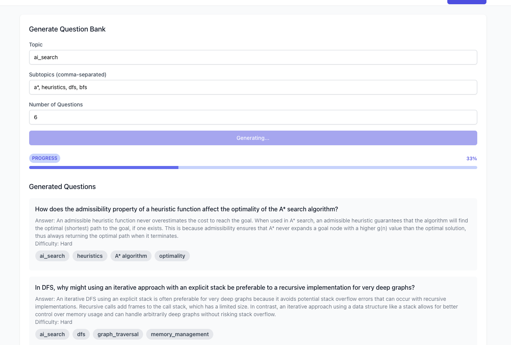

# TopicQA.AI

Imagine you're a curious learner, a dedicated student, or a professional looking to master a new subject quickly. You've tried flashcards, textbooks, and generic online quizzes, but nothing seems to capture the depth of knowledge you're after. Enter TopicQA.AI, your personal learning companion that transforms any topic into an interactive, tailored learning experience. With just a few clicks, you can generate a comprehensive question bank on anything from quantum physics to ancient philosophy, harnessing the power of Claude 3.5 to create challenging, thought-provoking questions that push your understanding to new heights.

But TopicQA.AI isn't just about creating questions - it's about supercharging your learning journey. As you dive into your custom-crafted question bank, the intelligent interface adapts to your progress, allowing you to filter questions by difficulty, status, and tags. Struggling with a particularly tricky concept? Submit your open-ended answers and watch as Claude 3.5 provides instant, insightful feedback, explaining complex ideas with clarity and precision. With progress tracking across multiple subjects, you'll visually see your knowledge grow, motivating you to push further. Whether you're preparing for a crucial exam, upskilling for a career change, or simply satisfying your intellectual curiosity, TopicQA.AI turns the daunting task of learning into an engaging, personalized adventure that caters to your unique learning style and goals.

## Features

### Video Demo 
To see a demonstration of the user interface in action, check out this video:
[UI Demo Video](https://www.youtube.com/watch?v=gdCO83S5izI)

### Dashboard

The main dashboard provides an overview of your question banks and learning progress.

### Question Generation

Easily generate new question banks by specifying topics and subtopics.

### Answer Evaluation

See answers to all the questions you are currently working on.

### Test Screen

Submit open-ended answers and receive instant, insightful feedback.

# Setup 

## LLM Functionality Setup

1. Create a `.env` file in the root directory.
2. Add the following variables to the `.env` file:
   ```
   ANTHROPIC_API_KEY=YOUR_API_KEY
   REACT_APP_ANTHROPIC_API_KEY=YOUR_API_KEY
   ```

## Generating Questions

### Option 1: Web Interface (Slower)
1. Navigate to "Generate Question Bank" in the top right of the UI.
2. Specify the topic, subtopics, and number of questions.
3. Watch the generations happen in real-time.

**Note:** This method is not multithreaded. For faster generation, use Option 2.

### Option 2: Python Script (Faster)
1. Install required packages:
   ```
   pip install -r requirements.txt
   ```
2. Update `topics` and `subtopics` in `generate_questions.py`.
3. Run the script:
   ```
   python generate_questions.py
   ```
4. Update the `QuestionBanks` constant at the top of `GitQuestionApp.js`.

## Running the Application

### Prerequisites
- Node.js and npm (verify with `node -v` and `npm -v`)

### Steps
1. Navigate to the `question-app` directory.
2. Install dependencies:
   ```
   npm install
   ```
3. Start the proxy server:
   ```
   npm run start:proxy
   ```
4. In a new terminal, start the frontend:
   ```
   npm run start
   ```
5. Access the application at `http://localhost:3000`.

## Overall Flow


## Overall Logic


